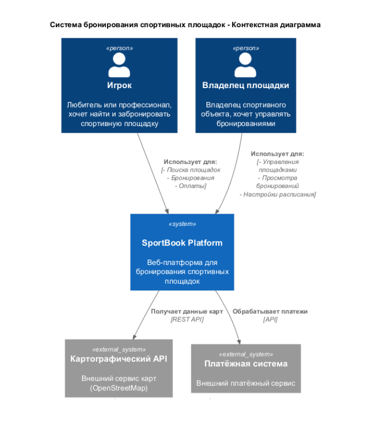
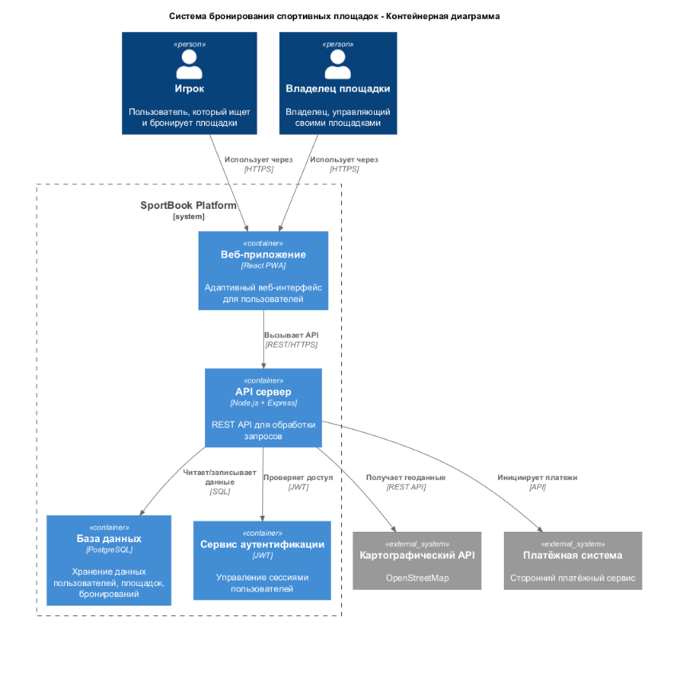
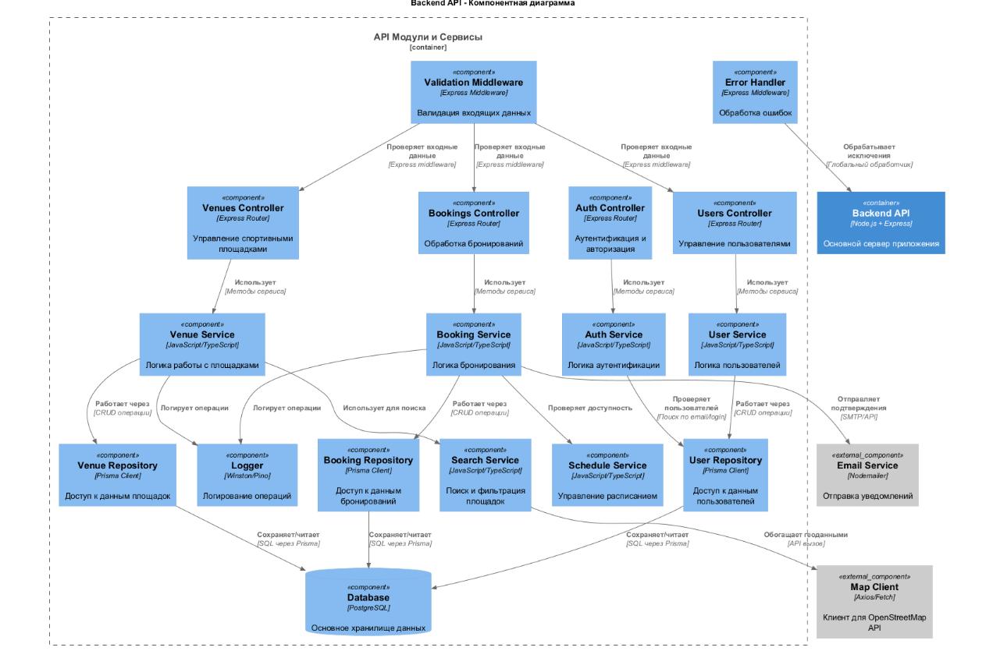
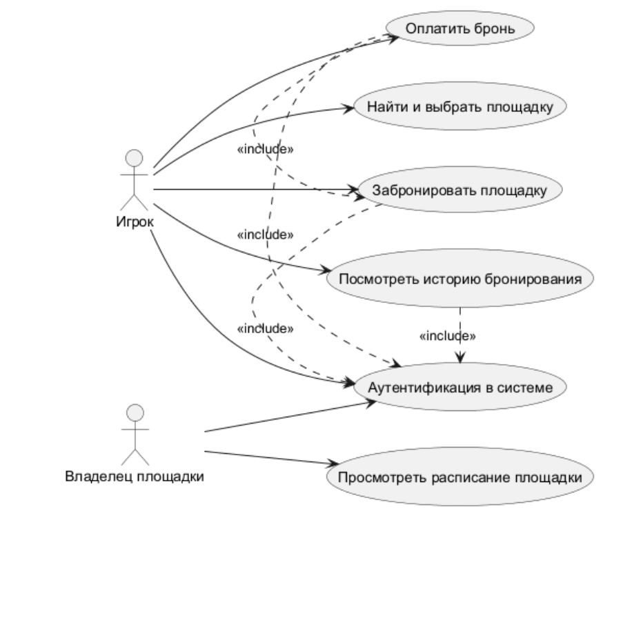
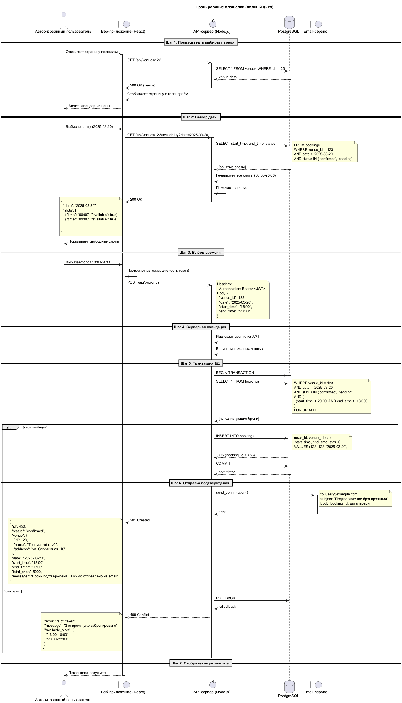

# CourtSync — платформа для бронирования спортивных площадок

Проект, который я сделал, чтобы показать навыки системного анализа: от бизнес-идеи до требований, рисков и критериев успеха.

## Задача за 1 минуту

Люди теряют время на поиск площадок через чаты и звонки. Владельцы площадок не могут управлять расписанием. Нужно спроектировать сервис, который решит эту проблему.

**Моя роль:** системный аналитик.  
**Результат:** документ VC (Vision and Scope) + артефакты

## Что внутри

| Артефакт | Кратко |
|----------|--------|
| [Business Requirements](./docs/Vision&Scope_CourtSync.pdf) | Контекст, цели, критерии успеха по RACE, риски |

## Ключевые артефакты

### Архитектура (C4)
| Контекст (C1) | Контейнеры (C2) | Компоненты (C3) |
|---------------|----------------|-----------------|
|  |  |  |

### Диаграммы процессов
| Use Case | Sequence: Бронирование |
|----------|------------------------|
|  |  |

### Требования и планирование
| User Journey Map | Product Backlog |
|------------------|-----------------|
|  |  |
---

## Главное, что я сделал

- **Сформулировал бизнес-цели** и разбил их на измеримые критерии (RACE)
- **Описал риски** с вероятностью и влиянием
- **Выделил 2 типа пользователей** (игрок и владелец) — отдельно ценности, интересы, ограничения
- **Определил MVP** (каталог, бронирование, личные кабинеты) и отложенные функции
- **Прописал бизнес-контекст** заинтересованных лиц, приоритеты, допущения

---

## Технологии, которые я использовал

- **Документирование:** Markdown, PDF
- **Диаграммы:** PlantUML, Draw.io, Figma
- **Управление требованиями:** Notion

---

## Как посмотреть детали

- [Vision & Scope (PDF)](./docs/Vision&Scope_CourtSync.pdf) 

---

## Контакты

- Telegram: @titovivan005  
- Email: ivantitov005@yandex.com  
- GitHub: [github.com/ivantitov05](https://github.com/ivantitov05)
